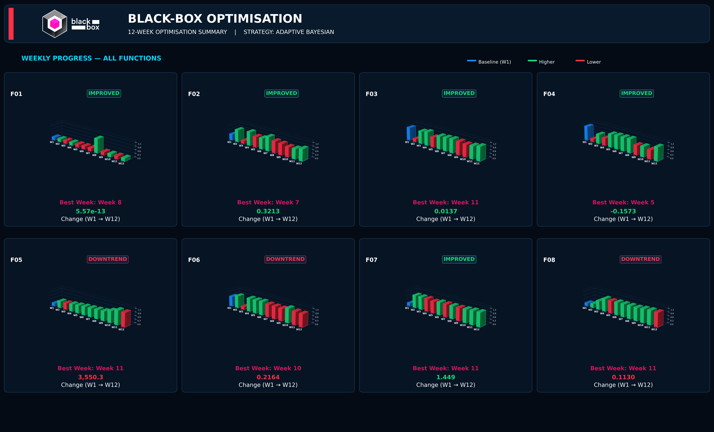
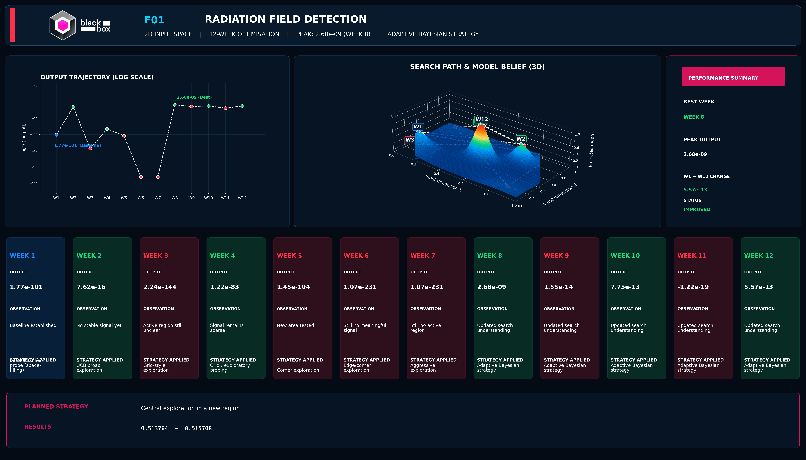
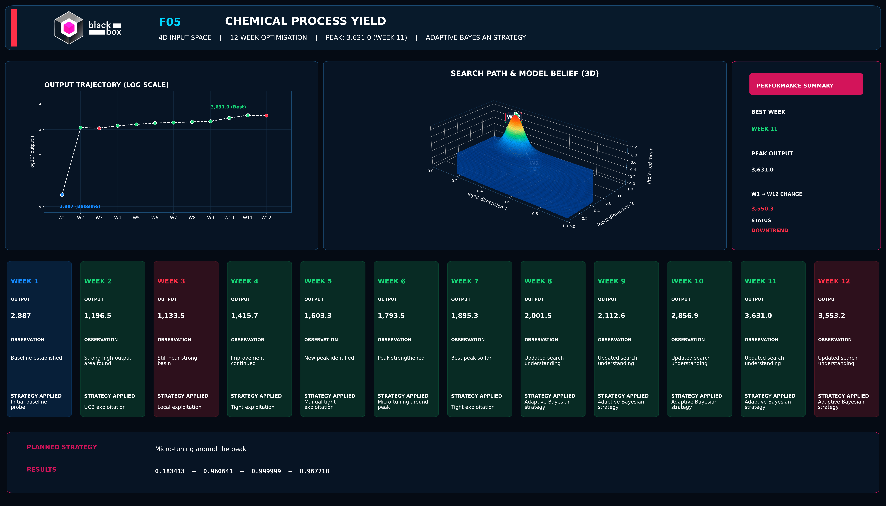
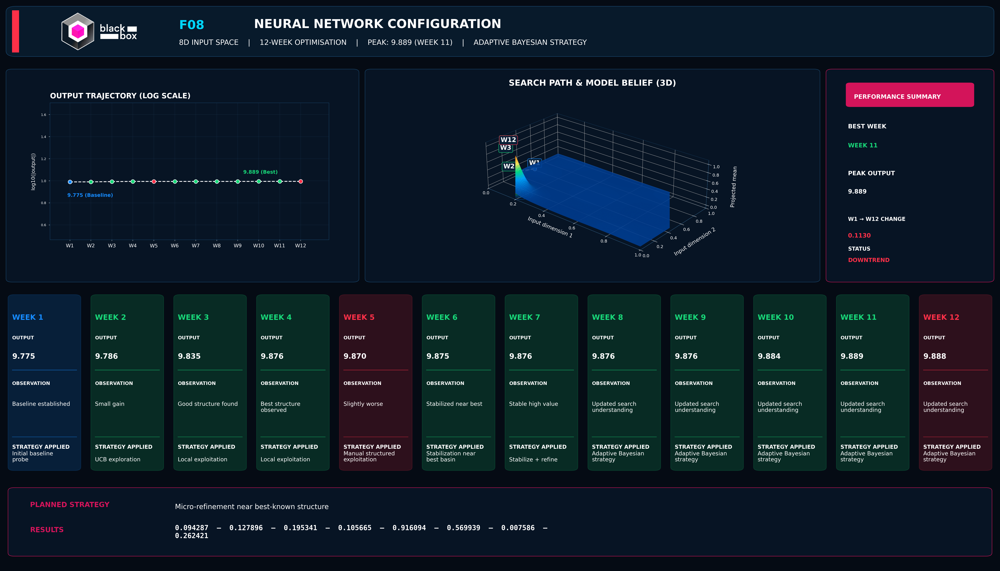

# Black-Box Optimisation using Gaussian Process Bayesian Optimisation
> Technical Documentation

---

## Technical Overview

This project implements a sequential Bayesian optimisation framework for solving eight expensive black-box optimisation problems under a constrained evaluation budget.

Each optimisation task is treated independently, using Gaussian Process Regression (GPR) with a Matérn kernel as the surrogate model. At every iteration, all previously observed evaluations for a given function are incorporated into its surrogate to estimate both the expected objective value and the predictive uncertainty across the input space.

Candidate points are selected using an acquisition strategy that balances exploration of uncertain regions against exploitation of high-performing ones. Rather than following a fixed schedule, the balance is adjusted per function based on observed behaviour: functions that keep improving are pushed toward tighter local exploitation, while functions that regress or stagnate trigger a rollback to their strongest previously verified basin before continuing. This anchor-based mechanism prevents a single noisy evaluation from derailing an otherwise strong search trajectory — a practical addition on top of the standard GP-UCB loop, motivated by the noise levels observed in several of the eight functions.

---

## Optimisation Workflow

Each weekly cycle follows the same sequence, per function:

1. Load the accumulated observation history for the function.
2. Fit a Gaussian Process surrogate (Matérn kernel) to that history.
3. Identify the strongest verified result so far and use it as the search anchor.
4. Select a strategy for this round — broad exploration (UCB), anchored local exploitation, trust-region refinement, or rollback — based on how the function performed in recent rounds.
5. Optimise the acquisition function within the chosen search region to select the next candidate.
6. Cross-check the candidate against an external reference result, adopting it only if it is demonstrably stronger than the current anchor.
7. Log the decision and the resulting query point; repeat once the next round's result is observed.

---

## Benchmark Problems

| Function | Dimensions |
|-----------|-----------:|
| F01 | 2 |
| F02 | 2 |
| F03 | 3 |
| F04 | 4 |
| F05 | 4 |
| F06 | 5 |
| F07 | 6 |
| F08 | 8 |

---

## Methodology

The implementation combines:

- Gaussian Process Regression with a Matérn kernel
- Upper Confidence Bound (UCB) acquisition for exploration
- Anchored local exploitation and trust-region refinement for exploitation
- Sequential, round-based design of experiments
- Per-function adaptive strategy selection, driven by observed performance rather than a fixed policy
- External-reference cross-checking against each function's own best result
- Automated visual analytics generated directly from the optimisation history

The strategy for each function evolves independently — a function that plateaus early is treated differently from one that keeps improving, and the notebook's dashboards make that per-function reasoning explicit rather than collapsing it into a single global search policy.

---

## Results

For every benchmark function, the notebook automatically generates:

- Gaussian Process belief surfaces over the input space
- Weekly optimisation dashboards
- Per-function performance summaries
- Applied optimisation strategy per round
- Final optimisation recommendations
- A portfolio-level comparison dashboard across all eight functions

---

## Portfolio Summary


---

## Weekly Strategy


---

## Applied Strategy Table


---

## Example Dashboard – Function F01


---

## Example Dashboard – Function F05


---

## Example Dashboard – Function F08


---

## Repository Structure

```
BBO_ML_CP
│
├── Data/
├── Images/
├── Gaussian-Bayesian Weekly Optimisation Tracker.ipynb
├── README.md
├── README_Technical.md
├── BBO_Datasheet.md
├── BBO_Model_Card.md
└── LICENSE
```

---

## Documentation

- [`BBO_Datasheet.md`](BBO_Datasheet.md) — data sources, structure, and provenance
- [`BBO_Model_Card.md`](BBO_Model_Card.md) — modelling approach, assumptions, and limitations
- [`BBO_Project_Overview.md`](BBO_Project_Overview.md) — extended project write-up

---

## Technologies

- Python
- NumPy
- Pandas
- scikit-learn (`GaussianProcessRegressor`, Matérn kernel)
- Matplotlib (incl. `mpl_toolkits.mplot3d`)
- Jupyter Notebook

---

## References

- Rasmussen, C. E., & Williams, C. K. I. (2006). *Gaussian Processes for Machine Learning*. MIT Press.
- Snoek, J., Larochelle, H., & Adams, R. P. (2012). *Practical Bayesian Optimization of Machine Learning Algorithms*. NeurIPS.

---

## License

See [`LICENSE`](LICENSE) for details.
